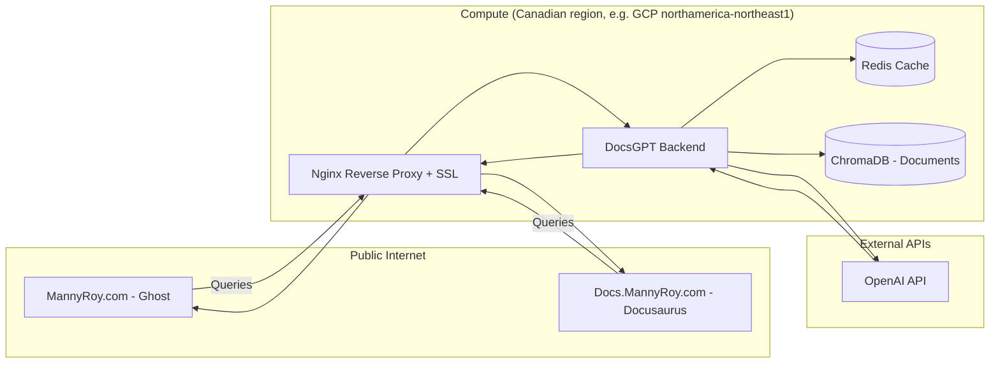

# DocsGPT implementation plan

This document captures the **step‑by‑step plan that was used** to deploy [DocsGPT](https://github.com/arc53/DocsGPT) as the sitewide AI assistant on the docs site (Docusaurus) and the main professional site (Ghost). One backend, one knowledge base, one widget embedded on both. It doubles as a replayable runbook if you want to reproduce the same architecture elsewhere.

**Related:** [AI assistant design](design), [Roadmap](../reference/roadmap).

---

## 1. Overview and goals

| Goal | How DocsGPT delivers it |
|------|-------------------------|
| Chatbot on both sites | Same embeddable widget; one `apiHost` used on Ghost and Docusaurus. |
| Answers from our content only | Single DocsGPT project with sources = docs site + main site (and optionally repo). |
| Source citations | Widget `showSources: true`; users can verify answers. |
| Maintainable | One place to add sources, tune LLM, and update branding. |

**Out of scope for this plan:** Custom LLM fine-tuning, multi-language, or advanced moderation (can be added later).

### Self-hosted vs DocsGPT Cloud

| Responsibility | DocsGPT Cloud | Self-hosted |
|----------------|----------------|-------------|
| **Server hosting** | No | Yes — you manage the server(s). |
| **Backend hosting** | No | Yes — you host the DocsGPT API and services. |
| **Vector DB** | No | Yes — you host and persist the vector database. |
| **Docker** | Not required | Moderate — requires Docker and Compose. |
| **Data location** | DocsGPT servers | Your servers. |

This plan focuses on **self-hosted** deployment to own the full stack and demonstrate DevOps control over servers, backend, vector DB, and containerization. **Hosting:** Use **Canadian servers** (see [§3.1 Server hosting](#31-server-hosting)) so the assistant backend and data run in Canada.

**Single-brain strategy:** One DocsGPT backend (e.g. on GCP) serves both sites. Use a dedicated subdomain such as `assistant-api.mannyroy.com` for the API. **SSL is mandatory** — browsers block the chat widget if the site is HTTPS but the assistant API is HTTP. Use Nginx (or Caddy) with Certbot (Let’s Encrypt) to terminate TLS. Configure **CORS** in DocsGPT so the widget on `mannyroy.com` and `docs.mannyroy.com` can call the API (see [§4 Phase 1](#4-phase-1-backend-docsgpt-api) and [§3.5 Nginx and SSL](#35-nginx-and-ssl)).

---

## 2. Prerequisites

- **Server (self-hosted only)** — A VPS or cloud VM in a **Canadian region** (GCP Montreal/Toronto, AWS ca-central-1, Azure Canada Central/East, DigitalOcean or Vultr Toronto, or Fly.io yyz). See [§3.1 Server hosting](#31-server-hosting).
- **Docker & Docker Compose** — For self-hosted backend ([Docker install](https://docs.docker.com/get-docker/)). Moderate Docker/Compose knowledge is expected ([§3.4 Docker](#34-docker)).
- **LLM access** — Either:
  - DocsGPT public API (quick start, no key), or
  - Cloud provider (OpenAI, Anthropic, Google, etc.) with API key, or
  - Local Ollama (CPU/GPU).
- **Repos and URLs** — Access to:
  - Docs site URL: `https://docs.mannyroy.com` (or built docs output).
  - Main site URL: `https://mannyroy.com` (and key paths, e.g. `/ghost-application/`, blog).
- **Theme and Docusaurus access** — Ability to edit Ghost `default.hbs` and Docusaurus config or layout.

---

## 3. Self-hosted infrastructure (DevOps)

When you self-host, you are responsible for **server hosting**, **backend hosting**, **vector DB**, and **Docker**. The sections below spell out what each entails and how to set them up.

### 3.1 Server hosting

You need a machine that will run the DocsGPT stack 24/7 and be reachable by the widget on your sites.

**Canadian servers (project requirement):** Use a **Canadian region/datacentre** for this project so the DocsGPT backend and data stay in Canada (latency, privacy, and compliance). When creating the VM or VPS, select one of the regions below.

**Options (Canadian regions):**

- **GCP Compute Engine** — `northamerica-northeast1` (Montreal) or `northamerica-northeast2` (Toronto). Use a small instance (e.g. e2-small or e2-medium: 2 vCPU, 4 GB RAM).
- **AWS EC2** — `ca-central-1` (Montreal). Same sizing as above.
- **Azure VM** — `canada-central` (Toronto) or `canada-east` (Quebec City).
- **VPS with Canadian DC** — **DigitalOcean** (Toronto), **Vultr** (Toronto). Single node is enough for moderate traffic. (Linode and Hetzner do not offer Canadian regions.)
- **PaaS with Docker** — **Fly.io** supports Toronto (`yyz`). For Railway or Render, check current region options and choose a Canadian one if available; otherwise prefer a VPS/cloud VM in Canada.

**Recommendations:**

- **Region:** Always select a Canadian region when provisioning (see list above). Avoid US or EU regions for this project.
- **OS:** Ubuntu 22.04 LTS or similar; keep it updated (`apt update && apt upgrade -y`).
- **Resources:** Minimum ~2 vCPU, 4 GB RAM; 8 GB RAM is safer if you run embeddings and LLM (e.g. Ollama) on the same box.
- **Firewall:** Open only SSH (22), HTTP (80), HTTPS (443). Expose DocsGPT API via a reverse proxy (see below), not by opening internal ports (e.g. 7091) to the internet.
- **SSH:** Use key-based auth; disable password login. Consider a non-root user and sudo.
- **Updates:** Schedule security updates (e.g. `unattended-upgrades`) and document reboot/restart procedures.

**Deliverable:** A server (or PaaS environment) with Docker and Docker Compose installed, SSH or secure access, and firewall configured.

### 3.2 Backend hosting

The “backend” here is the **DocsGPT API and related services** that the widget calls. You host these yourself.

**What DocsGPT runs (typical Docker Compose stack):**

- **API (Python)** — Main backend; handles chat, embeddings, and vector search. Expose this (behind a reverse proxy) as `apiHost` for the widget. Often port **7091** internally.
- **Frontend (Vite/Node)** — Admin UI for adding sources and testing chat. Optional to expose publicly; can be restricted or omitted in production if you only use the widget.
- **Worker (Celery)** — Background jobs for ingestion and training. Runs alongside the API; no direct exposure.
- **Redis** — Message broker for Celery. Internal only.
- **MongoDB** — Application data (users, projects, metadata). Internal only.

**Hosting responsibilities:**

- Run the stack via Docker Compose on your server (see §3.4).
- Put a **reverse proxy** (e.g. Nginx or Caddy) in front of the API so that:
  - External traffic hits `https://docsgpt.yourdomain.com` (or a subdomain) and is proxied to the API container (e.g. `http://localhost:7091`).
  - TLS is terminated at the proxy (e.g. Let’s Encrypt). The widget then uses `apiHost: 'https://docsgpt.yourdomain.com'`.
- Optionally restrict the admin UI to a private URL or VPN; at minimum protect it (e.g. auth or IP allowlist) if exposed.
- Use **env vars** for secrets (API keys, DB credentials); never commit them. Restart containers after changing `.env`.
- **CORS:** Set `CORS_ALLOWED_ORIGINS` in `.env` so the widget on your sites can call the API, e.g. `https://mannyroy.com,https://docs.mannyroy.com` (no trailing slashes; comma-separated). Without this, browser requests from Ghost or Docusaurus will be blocked.

**Deliverable:** DocsGPT API reachable over HTTPS at a stable URL; that URL becomes `apiHost` in the widget on both sites.

### 3.3 Vector database

DocsGPT stores document embeddings in a **vector database** so it can do semantic search (RAG). When you self-host, you host this DB as well.

**What’s involved:**

- **Role:** Stores vectors (embeddings) for ingested content; the API queries it to find relevant chunks before generating answers.
- **Options (depending on DocsGPT version):** Chroma (common in default Docker setup), Qdrant, or others. Check the [DocsGPT deployment](https://docs.docsgpt.cloud/Deploying/Docker-Deploying) and [Settings](https://docs.docsgpt.cloud/Deploying/DocsGPT-Settings) for `VECTOR_DB` and related env vars.
- **Persistence:** Vector data is often stored in a volume (e.g. `./application/vectors/` or a named volume). Ensure that volume is **backed up** so re-ingestion isn’t the only recovery path.
- **Resources:** Vector DB can use noticeable RAM and disk; size both for your corpus. Default embedding model (e.g. `all-mpnet-base-v2`) runs inside the stack; no separate “vector DB server” unless you switch to a remote DB (e.g. Qdrant Cloud).

**Operational checklist:**

- Confirm which vector DB your `docker-compose.yaml` and `.env` use (e.g. Chroma vs Qdrant).
- Map the vector store to a **persistent volume** in Docker; do not rely on ephemeral container storage.
- Document **backup/restore** (e.g. volume backup or export) and **re-ingestion** steps after restore.
- If you add many sources or large docs, monitor disk and memory.

**Deliverable:** Vector DB running as part of the stack, persisted to a volume, with backup and re-ingestion documented.

### 3.4 Docker

DocsGPT is run as a **multi-container** application with Docker Compose. You need basic Docker and Compose knowledge to deploy, debug, and maintain it.

**Concepts:**

- **Compose file:** Typically `deployment/docker-compose.yaml` in the DocsGPT repo. Defines services: API, frontend, worker, Redis, MongoDB, and (depending on config) vector store (e.g. Chroma) or embedding service.
- **Services:** Each service (API, worker, Redis, etc.) runs in its own container; they communicate over a Compose network. Only the API (and optionally frontend) need to be exposed to the host or reverse proxy.
- **Volumes:** Use named or bind volumes for MongoDB data, vector store data, and any file uploads so data survives `docker compose down` and container updates.
- **Environment:** `.env` in the repo root (or passed via `--env-file`) drives `LLM_PROVIDER`, `API_KEY`, `VECTOR_DB`, `EMBEDDINGS_NAME`, etc. Containers must be recreated after `.env` changes (`docker compose up -d --force-recreate` or equivalent).

**Commands you’ll use:**

```bash
# Start the stack (from DocsGPT repo root)
docker compose -f deployment/docker-compose.yaml up -d

# View logs (all services or a specific one)
docker compose -f deployment/docker-compose.yaml logs -f
docker compose -f deployment/docker-compose.yaml logs -f api

# Stop the stack
docker compose -f deployment/docker-compose.yaml down

# Rebuild and start after code or env changes
docker compose -f deployment/docker-compose.yaml up -d --build
```

**Difficulty:** Moderate — you should be comfortable with `docker compose`, reading `docker-compose.yaml`, and mapping ports/volumes. The [DocsGPT Docker guide](https://docs.docsgpt.cloud/Deploying/Docker-Deploying) is the source of truth for the exact file paths and optional Ollama overrides.

**Deliverable:** Stack running under Docker Compose; you can start, stop, view logs, and recreate containers after config changes.

### 3.5 Nginx and SSL

The widget runs in the browser on your HTTPS sites; it must call the DocsGPT API over **HTTPS**. Use a reverse proxy on the same host as Docker to terminate TLS and proxy to the API container.

**Recommended: Nginx + Certbot (Let’s Encrypt)**

1. Install Nginx and Certbot on the VM (e.g. `apt install nginx certbot python3-certbot-nginx`).
2. Create a server block for your API subdomain (e.g. `assistant-api.mannyroy.com`). Point the DNS A record for that subdomain to your VM’s IP.
3. Use Certbot to obtain and renew a certificate: `certbot --nginx -d assistant-api.mannyroy.com`.
4. Configure Nginx to proxy requests to the DocsGPT backend (e.g. `http://127.0.0.1:7091`). Serve the widget script from the same origin or from the backend if DocsGPT serves it at `/widget.js`.

**Example Nginx configuration** (adjust domain and upstream port to match your setup):

```nginx
# /etc/nginx/sites-available/assistant-api.mannyroy.com
server {
    listen 80;
    server_name assistant-api.mannyroy.com;
    # Certbot will add the HTTPS server block and redirect
    return 301 https://$host$request_uri;
}

server {
    listen 443 ssl http2;
    server_name assistant-api.mannyroy.com;

    # Certbot places these; adjust paths if different
    ssl_certificate     /etc/letsencrypt/live/assistant-api.mannyroy.com/fullchain.pem;
    ssl_certificate_key /etc/letsencrypt/live/assistant-api.mannyroy.com/privkey.pem;

    location / {
        proxy_pass http://127.0.0.1:7091;
        proxy_http_version 1.1;
        proxy_set_header Host $host;
        proxy_set_header X-Real-IP $remote_addr;
        proxy_set_header X-Forwarded-For $proxy_add_x_forwarded_for;
        proxy_set_header X-Forwarded-Proto $scheme;
        proxy_read_timeout 300;
        proxy_connect_timeout 300;
        proxy_send_timeout 300;
    }
}
```

Enable the site, run `certbot --nginx -d assistant-api.mannyroy.com`, then reload Nginx. Ensure the DocsGPT API container is listening on `7091` (or the port your Compose file exposes). Your widget `apiHost` will be `https://assistant-api.mannyroy.com`.

**Deliverable:** API served over HTTPS at your chosen subdomain; widget can load and call it from both Ghost and Docusaurus.

### 3.6 Architecture overview (data and traffic flow)

With one backend (e.g. on GCP), traffic and data flow as follows. This view is useful for DevOps and portfolio documentation.



---

## 4. Phase 1: Backend (DocsGPT API)

Decide: **self-hosted** (recommended for DevOps control) or **DocsGPT Cloud**.

### Option A: Self-hosted (Docker)

Follow [§3 Self-hosted infrastructure](#3-self-hosted-infrastructure-devops) for server, backend, vector DB, and Docker. Then:

1. Clone and configure:
   ```bash
   git clone https://github.com/arc53/DocsGPT.git
   cd DocsGPT
   ```
2. Create `.env` in repo root. Minimal (public LLM API) plus CORS for your two sites:
   ```env
   LLM_PROVIDER=docsgpt
   VITE_API_STREAMING=true
   CORS_ALLOWED_ORIGINS=https://mannyroy.com,https://docs.mannyroy.com
   ```
   For your own LLM, set e.g. `LLM_PROVIDER`, `LLM_NAME`, `API_KEY`; for vector DB and embeddings, set `VECTOR_DB`, `EMBEDDINGS_NAME` as needed. **CORS is required** so the widget on Ghost and Docusaurus can call the API. See [DocsGPT Settings](https://docs.docsgpt.cloud/Deploying/DocsGPT-Settings).

   **If using simple JWT auth** (`AUTH_TYPE=simple_jwt`): add `JWT_SECRET_KEY=your_secret_key_here` to `.env` (or leave unset and DocsGPT will generate one). A single JWT token is **generated at startup and printed to the backend container logs**. To get the token: run `docker compose -f deployment/docker-compose.yaml logs api` (or `logs backend`) and copy the token from the startup output. Paste it into the browser when the DocsGPT UI prompts for the JWT. If you missed it, restart the API container and watch the logs again.
3. Start stack:
   ```bash
   docker compose -f deployment/docker-compose.yaml up -d
   ```
4. Confirm UI at `http://localhost:5173` (or your host). Note the **backend API base URL** (e.g. `http://localhost:7091` for API; check DocsGPT docs for your version). In production, expose the API via reverse proxy over HTTPS and use that URL as `apiHost`.

### Option B: DocsGPT Cloud

1. Sign up at [DocsGPT Cloud](https://docs.docsgpt.cloud/) (or current cloud offering).
2. Create a project; note **API host** (e.g. `https://gptcloud.arc53.com`) and **API key** if required.
3. Skip Docker; use cloud for backend and ingestion.

**Deliverable:** A stable `apiHost` (and optional `apiKey`) to use in both embeds.

---

## 5. Phase 2: Knowledge base (sources)

Use **one DocsGPT project** so the same assistant serves both sites.

### Add sources

In the DocsGPT UI (or via API):

1. **Ghost site (main site)**
   - **Source type:** Documentation URL or sitemap.
   - **URL:** `https://mannyroy.com/sitemap.xml` so the bot indexes all blog posts and key pages (or base URL for crawler).
   - Train and wait for ingestion to finish.

2. **Docusaurus site (docs)**
   - **Source type:** Documentation URL or sitemap.
   - **URL:** `https://docs.mannyroy.com` or `https://docs.mannyroy.com/sitemap.xml` if available.
   - Train and wait.

3. **Combine**
   - In the DocsGPT dashboard, group these into a single **Source** (or single project) so the assistant can search both sites in one place.

4. **Optional: repo content**
   - If you want answers from raw docs (e.g. `docs-site/docs/**/*.md`), add source:
     - **GitHub repo** (e.g. `mannyroy/ghost-custom` with path to `docs-site/docs`), or
     - **Upload:** export or copy Markdown files and use “Direct upload” (MD supported).

### Source checklist

- [ ] Ghost site (mannyroy.com/sitemap.xml or base URL) added and trained.
- [ ] Docusaurus site (docs.mannyroy.com) added and trained.
- [ ] Both combined in one Source/project for the widget.
- [ ] Optional: repo or static docs added.

**Deliverable:** One project with all relevant content; chat in the DocsGPT UI returns answers with sources from both sites.

---

## 6. Phase 3: Embed on Ghost (main site)

Goal: Widget on every page of the main site.

### Option A: Code Injection (recommended)

Ghost supports **Code Injection** so you can add the widget site-wide without editing the theme.

1. Log in to **Ghost Admin**.
2. Go to **Settings → Code Injection**.
3. In **Site Footer**, paste the DocsGPT script. Use your API URL (e.g. `https://assistant-api.mannyroy.com`) and optional API key. If your DocsGPT instance serves a widget at `/widget.js`, reference it; otherwise use the unpkg bundle and a small inline config.

   **If DocsGPT serves the widget at your API origin:**
   ```html
   <script
     src="https://assistant-api.mannyroy.com/widget.js"
     data-api-key="YOUR_API_KEY"
     data-api-url="https://assistant-api.mannyroy.com"
     data-title="Manny's Assistant"
   ></script>
   ```

   **Alternative (unpkg + render function):** if your setup uses the `docsgpt` package’s script and `renderDocsGPTWidget`:
   ```html
   <div id="docsgpt-widget-root"></div>
   <script src="https://unpkg.com/docsgpt/dist/modern/main.js" type="module"></script>
   <script type="module">
     window.addEventListener('load', function () {
       if (typeof renderDocsGPTWidget === 'function') {
         renderDocsGPTWidget('docsgpt-widget-root', {
           apiHost: 'https://assistant-api.mannyroy.com',
           apiKey: '',
           showSources: true,
           title: "Manny's Assistant",
           description: 'Ask about our services, docs, and Ghost application.',
           heroTitle: 'Manny Roy Consulting',
           heroDescription: 'Answers are based on our documentation and site content. Check sources for details.',
           theme: 'light',
           buttonBg: '#222327'
         });
       }
     });
   </script>
   ```

4. **Save.** The chat bubble will appear on every page of the blog.

### Option B: Theme layout

If you prefer to ship the widget from the theme (e.g. `default.hbs`), add the same container and script before `</body>` as in Option A. Use a single config variable for `apiHost` if your theme supports it so dev/staging/prod can point to different backends.

### Test

- Load mannyroy.com (and a few pages); open the widget and ask a question that should be answered from docs or main site. Confirm sources appear when `showSources: true`.

**Deliverable:** Widget visible and working on the main Ghost site.

---

## 7. Phase 4: Embed on Docusaurus (docs site)

Goal: Same widget on every docs page.

### Option A: Config method (easiest)

Add the widget via Docusaurus’s global `scripts` so it loads on every page. If your DocsGPT backend serves the widget at `/widget.js`, use the script tag with data attributes:

1. Edit `docusaurus.config.ts` (or `docusaurus.config.js`).
2. Add to the config’s top-level `scripts` array (see [Docusaurus scripts](https://docusaurus.io/docs/configuration#scripts)):

   ```ts
   // docusaurus.config.ts — add to config
   scripts: [
     {
       src: 'https://assistant-api.mannyroy.com/widget.js',
       async: true,
       'data-api-key': 'YOUR_API_KEY',
       'data-api-url': 'https://assistant-api.mannyroy.com',
       'data-title': "Manny's Assistant",
     },
   ],
   ```

   Replace `assistant-api.mannyroy.com` and `YOUR_API_KEY` with your API host and key (or omit `data-api-key` if not required). Rebuild and deploy; the chat bubble will appear site-wide.

### Option B: Script tag + container (unpkg / renderDocsGPTWidget)

1. In `docusaurus.config.ts`, add the script in `scripts` and ensure the widget container exists (e.g. via a [client module](https://docusaurus.io/docs/advanced/client-modules) or swizzled root layout that renders `<div id="docsgpt-widget-root">` and a small script that calls `renderDocsGPTWidget('docsgpt-widget-root', { apiHost: '...', ... })`).
2. Use the **same** `apiHost` and `apiKey` as on Ghost.

### Option C: React component (most control)

If you want more control (e.g. show the bot only on certain pages or pass a version), install the `docsgpt` package and add the widget in a layout component:

1. **Install package**
   ```bash
   cd docs-site
   yarn add docsgpt
   ```

2. **Add widget to layout**
   - Swizzle the root layout, e.g. `@theme/Root`, or the layout component that wraps all pages.
   - Render the widget so it appears on every route (or conditionally by route):
   ```tsx
   import { DocsGPTWidget } from 'docsgpt';

   export default function Root({ children }) {
     return (
       <>
         {children}
         <DocsGPTWidget
           apiHost="https://assistant-api.mannyroy.com"
           apiKey=""
           showSources={true}
           title="Get AI assistance"
           description="Ask about the theme, docs, and application."
           heroTitle="Manny Roy Consulting — Docs"
           heroDescription="Answers are based on this documentation and the main site. Check sources for details."
           theme="light"
           buttonBg="#222327"
         />
       </>
     );
   }
   ```

3. **Optional: versioning**
   - You can pass a "version" or context (e.g. doc version) to DocsGPT so the bot can tailor answers (e.g. "user is on v2 docs"). Check DocsGPT’s widget/API for version or context parameters.

4. **Config via env (optional)**
   - Use `process.env.DOCSGPT_API_HOST` (or similar) in Docusaurus so the same build can target different backends (e.g. staging vs prod).

**Deliverable:** Widget visible and working on docs.mannyroy.com with same backend and behaviour as Ghost.

---

## 8. Phase 5: Configuration and branding

- **apiHost / apiKey** — Same on both sites; keep keys in env, not in repo.
- **Theme** — Match site: e.g. `theme: 'light'` or `'dark'`; consider `respectPrefersColorScheme` if you add a small wrapper later.
- **Copy** — Set `title`, `description`, `heroTitle`, `heroDescription` to reflect “Manny Roy Consulting” and that answers are from your content; use hero text for light disclaimers.
- **Avatar / button icon** — Optional: set `avatar` and `buttonIcon` to your logo or icon URLs.
- **showSources** — Keep `true` so users can verify answers.

**Deliverable:** Consistent, on-brand widget on both sites and clear disclaimer in hero text.

---

## 9. Phase 6: Testing and validation

- [ ] **Backend:** Create a chat in DocsGPT UI; ask questions that should be answered from docs and from main site; confirm citations.
- [ ] **Ghost:** Open multiple pages (home, blog, Ghost application page); open widget, ask 2–3 questions; confirm answers and sources.
- [ ] **Docusaurus:** Open several doc pages; same questions; same behaviour and sources.
- [ ] **Out-of-scope:** Ask something unrelated; confirm the model stays on topic or says it doesn’t know (no critical hallucination).
- [ ] **Mobile:** Quick check that widget is usable on small screens.

**Deliverable:** Sign-off that the assistant is sitewide, accurate, and source-aware.

---

## 10. Phase 7: Deployment and operations

This phase ties together [§3 Self-hosted infrastructure](#3-self-hosted-infrastructure-devops): server, backend, vector DB, and Docker in a production setup.

### Server and Docker (recap)

- **Server:** Provision a VPS or cloud VM in a **Canadian region** (or PaaS with Canadian region, e.g. Fly.io Toronto); meet the requirements in [§3.1 Server hosting](#31-server-hosting). Install Docker and Docker Compose.
- **Stack:** Deploy DocsGPT with `docker compose -f deployment/docker-compose.yaml up -d` (and optional Ollama compose file if using local LLM). Use [§3.4 Docker](#34-docker) for day-to-day commands and restarts after `.env` changes.
- **Vector DB:** Ensure the vector store is on a persistent volume and backed up as in [§3.3 Vector database](#33-vector-database).

### Backend hosting (production)

- Run a **reverse proxy** (Nginx or Caddy) on the same host or in front of the API container. Use a dedicated subdomain such as `https://assistant-api.mannyroy.com` and proxy it to the DocsGPT API (e.g. `http://127.0.0.1:7091`). Terminate TLS (e.g. Let’s Encrypt); see [§3.5 Nginx and SSL](#35-nginx-and-ssl).
- Set `apiHost` in both Ghost and Docusaurus embeds to this public HTTPS URL. Do not expose internal ports (7091, 5173, etc.) directly to the internet.
- Use env vars for `API_KEY`, `LLM_PROVIDER`, and DB secrets; never commit them. Restart containers after changing `.env`.

### API key (optional)

- If you enable API key auth in DocsGPT, set the same key in both Ghost and Docusaurus (via env or server-side config) and pass it as `apiKey` to the widget.

### Re-ingestion

- When you add or change docs or main site content, re-run ingestion in the DocsGPT UI (or via API) for the affected source. Optionally automate on a schedule (e.g. cron + script or CI). Document the process in your ops runbook.

### Monitoring

- Optional: track errors (e.g. widget load failures, 5xx from API) via your existing observability (e.g. Netlify, Ghost, or error tracking). Document in [Observability](../operations/observability) if relevant.

### Pro tips (portfolio and ops)

- **Health checks:** Set up a simple **UptimeRobot** or **GCP Monitoring** alert on `https://assistant-api.mannyroy.com/health` (or your DocsGPT health endpoint) so you know when the API is down.
- **Logging:** Use Docker’s `json-file` logging driver and consider sending logs to **GCP Cloud Logging** (or another aggregator) so you can debug why the bot might fail to answer certain questions. Configure the Docker daemon or Compose logging options as needed.
- **Versioning (Docusaurus):** If you version your docs (e.g. v1 / v2), you can pass a version or context to DocsGPT so the bot can tailor answers (e.g. “user is on v2 docs”). Check the widget/API for version or context parameters when using the React component or script options.

**Deliverable:** Backend deployed and documented; re-ingestion, backup, key handling, and monitoring clear; server, backend, vector DB, and Docker all under your control.

---

## 11. Implementation checklist (summary)

| Phase | Task | Owner / notes |
|-------|------|----------------|
| Infra | **Server:** Provision VPS/VM in a **Canadian region**; OS, firewall, SSH; install Docker & Compose | §3.1 |
| Infra | **Backend:** Run DocsGPT stack; CORS for mannyroy.com + docs.mannyroy.com | §3.2 |
| Infra | **Vector DB:** Confirm persistence (volumes); backup and re-ingestion steps | §3.3 |
| Infra | **Docker:** Compose up; verify services, logs, restarts after `.env` changes | §3.4 |
| Infra | **Nginx + SSL:** Reverse proxy at assistant-api.mannyroy.com; Certbot/Let’s Encrypt | §3.5 |
| 1 | Get `apiHost` (+ `apiKey`); Cloud or self-hosted | §4 |
| 2 | Add docs site + main site (and optional repo) as sources; train; verify in UI | §5 |
| 3 | Add widget container + script in Ghost `default.hbs`; test on main site | §6 |
| 4 | Add widget to Docusaurus (script or React); test on docs site | §7 |
| 5 | Set branding, theme, hero text; keep sources on | §8 |
| 6 | Cross-browser and mobile smoke test; out-of-scope check | §9 |
| 7 | Production deploy: server, proxy, env, re-ingestion, monitoring | §10 |

After rollout, update [AI assistant design](design) with any scope/limitations and safeguards (e.g. rate limits, disclaimers) and link to this plan for implementation details.
