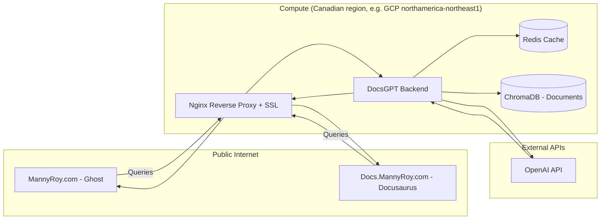

# BottyGPT / DocsGPT deployment story

This document captures **how we deployed** [DocsGPT](https://github.com/arc53/DocsGPT) as the sitewide AI assistant on the docs site (Docusaurus) and the main professional site (Ghost). One backend, one knowledge base, one widget embedded on both. It’s written as a showcase of the architecture choices we made.

**Related:** [AI assistant design](design), [Roadmap](../reference/roadmap).

---

## 1. Overview and goals

- **Chatbot on both sites** — same embeddable widget; one `apiHost` used on Ghost and Docusaurus.
- **Answers from our content only** — single DocsGPT project with sources = docs site + main site (and optionally repo).
- **Source citations** — widget `showSources: true`; we can verify answers and trace them back to the underlying docs/pages.
- **Maintainable** — one place to add sources, tune the LLM configuration, and update assistant branding.

**Not covered in this deployment story:** Custom LLM fine-tuning, multi-language, or advanced moderation (can be added later).

### Self-hosted vs DocsGPT Cloud

- **Server hosting** — DocsGPT Cloud: none; self-hosted: we manage the server(s).
- **Backend hosting** — DocsGPT Cloud: none; self-hosted: we host the DocsGPT API and services.
- **Vector DB** — DocsGPT Cloud: none; self-hosted: we host and persist the vector database.
- **Docker** — DocsGPT Cloud: not required; self-hosted: moderate Docker/Compose familiarity.
- **Data location** — DocsGPT Cloud: provider servers; self-hosted: we control where data lives.

We focused on **self-hosted** deployment to own the full stack and showcase DevOps control over servers, the backend, the vector DB, and containerization. **Hosting:** We used **Canadian servers** (see [§3.1 Server hosting](#31-server-hosting)) so the assistant backend and data run in Canada.

**Single-brain strategy:** One DocsGPT backend (e.g. on GCP) serves both sites. We use a dedicated subdomain such as `assistant-api.mannyroy.com` for the API. **SSL is mandatory** — browsers block the chat widget if the site is HTTPS but the assistant API is HTTP. We use Nginx (or Caddy) with Certbot (Let’s Encrypt) to terminate TLS. We configure **CORS** in DocsGPT so the widget on `mannyroy.com` and `docs.mannyroy.com` can call the API (see [§4 Phase 1](#4-phase-1-backend-docsgpt-api) and [§3.5 Nginx and SSL](#35-nginx-and-ssl)).

---

## 2. What we had in place

- **Server (self-hosted only)** — A VPS or cloud VM in a **Canadian region** (GCP Montreal/Toronto, AWS ca-central-1, Azure Canada Central/East, DigitalOcean or Vultr Toronto, or Fly.io yyz). See [§3.1 Server hosting](#31-server-hosting).
- **Docker & Docker Compose** — For the self-hosted backend. Moderate Docker/Compose familiarity helped ([§3.4 Docker](#34-docker)).
- **LLM access** — Either:
  - DocsGPT public API (quick start, no key), or
  - Cloud provider (OpenAI, Anthropic, Google, etc.) with API key, or
  - Local Ollama (CPU/GPU).
- **Repos and URLs** — Access to:
  - Docs site URL: `https://docs.mannyroy.com` (or built docs output).
  - Main site URL: `https://mannyroy.com` (and key paths, e.g. `/ghost-application/`, blog).
- **Theme and Docusaurus access** — Ability to edit Ghost `default.hbs` and Docusaurus config or layout.

---

## 3. Self-hosted infrastructure (DevOps)

In self-hosted mode, we own **server hosting**, **backend hosting**, **vector DB**, and **Docker**. The sections below capture what each component means in practice and how it fits into the overall stack.

### 3.1 Server hosting

We ran the DocsGPT stack on a machine that stays up 24/7 and is reachable by the widget on our sites.

**Canadian servers (project requirement):** We selected a **Canadian region/datacentre** for this project so the DocsGPT backend and data stay in Canada (latency, privacy, and compliance). When provisioning the VM or VPS, we selected from the regions below.

**Options (Canadian regions):**

- **GCP Compute Engine** — `northamerica-northeast1` (Montreal) or `northamerica-northeast2` (Toronto). Use a small instance (e.g. e2-small or e2-medium: 2 vCPU, 4 GB RAM).
- **AWS EC2** — `ca-central-1` (Montreal). Same sizing as above.
- **Azure VM** — `canada-central` (Toronto) or `canada-east` (Quebec City).
- **VPS with Canadian DC** — **DigitalOcean** (Toronto), **Vultr** (Toronto). Single node is enough for moderate traffic. (Linode and Hetzner do not offer Canadian regions.)
- **PaaS with Docker** — **Fly.io** supports Toronto (`yyz`). For Railway or Render, check current region options and choose a Canadian one if available; otherwise prefer a VPS/cloud VM in Canada.

**Recommendations:**

- **Region:** Always select a Canadian region when provisioning (see list above). Avoid US or EU regions for this project.
- **OS:** Ubuntu 22.04 LTS or similar; keep it updated (`apt update && apt upgrade -y`).
- **Resources:** Minimum ~2 vCPU, 4 GB RAM; 8 GB RAM is safer if we run embeddings and LLM (e.g. Ollama) on the same box.
- **Firewall:** Open only SSH (22), HTTP (80), HTTPS (443). Expose DocsGPT API via a reverse proxy (see below), not by opening internal ports (e.g. 7091) to the internet.
- **SSH:** Use key-based auth; disable password login. Consider a non-root user and sudo.
- **Updates:** Schedule security updates (e.g. `unattended-upgrades`) and document reboot/restart procedures.

**Deliverable:** A server (or PaaS environment) with Docker and Docker Compose installed, SSH or secure access, and firewall configured.

### 3.2 Backend hosting

The “backend” here is the **DocsGPT API and related services** that the widget calls. We host these ourselves.

**What DocsGPT runs (typical Docker Compose stack):**

- **API (Python)** — Main backend; handles chat, embeddings, and vector search. Expose this (behind a reverse proxy) as `apiHost` for the widget. Often port **7091** internally.
- **Frontend (Vite/Node)** — Admin UI for adding sources and testing chat. Optional to expose publicly; can be restricted or omitted in production if we only use the widget.
- **Worker (Celery)** — Background jobs for ingestion and training. Runs alongside the API; no direct exposure.
- **Redis** — Message broker for Celery. Internal only.
- **MongoDB** — Application data (users, projects, metadata). Internal only.

**Hosting responsibilities:**

- Run the stack via Docker Compose on our server (see §3.4).
- Put a **reverse proxy** (e.g. Nginx or Caddy) in front of the API so that:
  - External traffic hits `https://docsgpt.yourdomain.com` (or a subdomain) and is proxied to the API container (e.g. `http://localhost:7091`).
  - TLS is terminated at the proxy (e.g. Let’s Encrypt). The widget then uses `apiHost: 'https://docsgpt.yourdomain.com'`.
- Optionally restrict the admin UI to a private URL or VPN; at minimum protect it (e.g. auth or IP allowlist) if exposed.
- Use **env vars** for secrets (API keys, DB credentials); never commit them. Restart containers after changing `.env`.
- **CORS:** Set `CORS_ALLOWED_ORIGINS` in `.env` so the widget on our sites can call the API, e.g. `https://mannyroy.com,https://docs.mannyroy.com` (no trailing slashes; comma-separated). Without this, browser requests from Ghost or Docusaurus will be blocked.

**Deliverable:** DocsGPT API reachable over HTTPS at a stable URL; that URL becomes `apiHost` in the widget on both sites.

### 3.3 Vector database

DocsGPT stores document embeddings in a **vector database** so it can do semantic search (RAG). In self-hosted mode, we host this DB as well.

**What’s involved:**

- **Role:** Stores vectors (embeddings) for ingested content; the API queries it to find relevant chunks before generating answers.
- **Options (depending on DocsGPT version):** Chroma (common in default Docker setup), Qdrant, or others. Check the [DocsGPT deployment](https://docs.docsgpt.cloud/Deploying/Docker-Deploying) and [Settings](https://docs.docsgpt.cloud/Deploying/DocsGPT-Settings) for `VECTOR_DB` and related env vars.
- **Persistence:** Vector data is often stored in a volume (e.g. `./application/vectors/` or a named volume). Ensure that volume is **backed up** so re-ingestion isn’t the only recovery path.
- **Resources:** Vector DB can use noticeable RAM and disk; size both for our corpus. Default embedding model (e.g. `all-mpnet-base-v2`) runs inside the stack; no separate “vector DB server” unless we switch to a remote DB (e.g. Qdrant Cloud).

**Operational checklist:**

- Confirm which vector DB our `docker-compose.yaml` and `.env` use (e.g. Chroma vs Qdrant).
- Map the vector store to a **persistent volume** in Docker; do not rely on ephemeral container storage.
- Document **backup/restore** (e.g. volume backup or export) and **re-ingestion** steps after restore.
- If we add many sources or large docs, monitor disk and memory.

**Deliverable:** Vector DB running as part of the stack, persisted to a volume, with backup and re-ingestion documented.

### 3.4 Docker

DocsGPT is run as a **multi-container** application with Docker Compose. We rely on basic Docker/Compose knowledge to deploy, debug, and maintain it.

**Concepts:**

- **Compose file:** Typically `deployment/docker-compose.yaml` in the DocsGPT repo. Defines services: API, frontend, worker, Redis, MongoDB, and (depending on config) vector store (e.g. Chroma) or embedding service.
- **Services:** Each service (API, worker, Redis, etc.) runs in its own container; they communicate over a Compose network. Only the API (and optionally frontend) need to be exposed to the host or reverse proxy.
- **Volumes:** Use named or bind volumes for MongoDB data, vector store data, and any file uploads so data survives `docker compose down` and container updates.
- **Environment:** `.env` in the repo root (or passed via `--env-file`) drives `LLM_PROVIDER`, `API_KEY`, `VECTOR_DB`, `EMBEDDINGS_NAME`, etc. Containers must be recreated after `.env` changes (`docker compose up -d --force-recreate` or equivalent).

**Commands we used:**

```bash
# Start the stack (from DocsGPT repo root)
docker compose -f deployment/docker-compose.yaml up -d

# View logs (all services or a specific one)
docker compose -f deployment/docker-compose.yaml logs -f
docker compose -f deployment/docker-compose.yaml logs -f api

# Stop the stack
docker compose -f deployment/docker-compose.yaml down

# Rebuild and start after code or env changes
docker compose -f deployment/docker-compose.yaml up -d --build
```

**Difficulty:** Moderate — we expect comfort with `docker compose`, reading `docker-compose.yaml`, and mapping ports/volumes. The [DocsGPT Docker guide](https://docs.docsgpt.cloud/Deploying/Docker-Deploying) is the source of truth for the exact file paths and optional Ollama overrides.

**Deliverable:** Stack running under Docker Compose; we start/stop, view logs, and recreate containers after config changes.

### 3.5 Nginx and SSL

The widget runs in the browser on our HTTPS sites; it must call the DocsGPT API over **HTTPS**. We use a reverse proxy on the same host as Docker to terminate TLS and proxy to the API container.

Recommended: Nginx + Certbot (Let’s Encrypt)

We used Nginx + Certbot to terminate TLS for the API subdomain and proxy requests to the DocsGPT backend (e.g. `http://127.0.0.1:7091`). In our setup, Certbot issues/renews the certificate for `assistant-api.mannyroy.com`, and Nginx forwards traffic to the backend. The widget script is served from the same origin (or via the backend) so the browser can load it cleanly.

**Example Nginx configuration** (adjust domain and upstream port to match our setup):

```nginx
# /etc/nginx/sites-available/assistant-api.mannyroy.com
server {
    listen 80;
    server_name assistant-api.mannyroy.com;
    # Certbot will add the HTTPS server block and redirect
    return 301 https://$host$request_uri;
}

server {
    listen 443 ssl http2;
    server_name assistant-api.mannyroy.com;

    # Certbot places these; adjust paths if different
    ssl_certificate     /etc/letsencrypt/live/assistant-api.mannyroy.com/fullchain.pem;
    ssl_certificate_key /etc/letsencrypt/live/assistant-api.mannyroy.com/privkey.pem;

    location / {
        proxy_pass http://127.0.0.1:7091;
        proxy_http_version 1.1;
        proxy_set_header Host $host;
        proxy_set_header X-Real-IP $remote_addr;
        proxy_set_header X-Forwarded-For $proxy_add_x_forwarded_for;
        proxy_set_header X-Forwarded-Proto $scheme;
        proxy_read_timeout 300;
        proxy_connect_timeout 300;
        proxy_send_timeout 300;
    }
}
```

With this setup in place, the API is served over HTTPS at `https://assistant-api.mannyroy.com`, which becomes the widget `apiHost` used by both Ghost and Docusaurus.

**Deliverable:** API served over HTTPS at our chosen subdomain; widget can load and call it from both Ghost and Docusaurus.

### 3.6 Architecture overview (data and traffic flow)

With one backend (e.g. on GCP), traffic and data flow as follows. This view is useful for DevOps and portfolio documentation.



---

## 4. Phase 1: Backend (DocsGPT API)

For this project we ran DocsGPT in **self-hosted** mode to keep the stack under DevOps control. DocsGPT Cloud remains an alternative path, but it’s not the one we showcased here.

### Self-hosted (Docker Compose)

We built the backend using the stack described in [§3 Self-hosted infrastructure](#3-self-hosted-infrastructure-devops), running the full container set under Docker Compose:

1. We cloned and configured:

   ```bash
   git clone https://github.com/arc53/DocsGPT.git
   cd DocsGPT
   ```

2. We created `.env` in the repo root (minimal public LLM API) plus CORS for our two sites:

   ```env
   LLM_PROVIDER=docsgpt
   VITE_API_STREAMING=true
   CORS_ALLOWED_ORIGINS=https://mannyroy.com,https://docs.mannyroy.com
   ```

For our own LLM, we set e.g. `LLM_PROVIDER`, `LLM_NAME`, `API_KEY`; for vector DB and embeddings, we set `VECTOR_DB`, `EMBEDDINGS_NAME` as needed. **CORS is required** so the widget on Ghost and Docusaurus can call the API. See [DocsGPT Settings](https://docs.docsgpt.cloud/Deploying/DocsGPT-Settings).

   **If we enabled simple JWT auth** (`AUTH_TYPE=simple_jwt`): we set `JWT_SECRET_KEY` in `.env` (or left it unset and let DocsGPT generate one). A single JWT token is **generated at startup and printed to the backend container logs**. We copied it from the startup output (`docker compose -f deployment/docker-compose.yaml logs api`, or `logs backend`) and entered it in the DocsGPT UI. If we missed the output, we restarted the API container and checked the logs again.

1. We started the stack:

   ```bash
   docker compose -f deployment/docker-compose.yaml up -d
   ```

2. We confirmed the UI at `http://localhost:5173` (or our host). We also noted the **backend API base URL** (e.g. `http://localhost:7091` for API; check DocsGPT docs for our version). In production, the API is exposed via reverse proxy over HTTPS, and that URL becomes the widget `apiHost`.

### DocsGPT Cloud (alternative, not used here)

DocsGPT Cloud exists, but this deployment story focuses on the self-hosted path.

**Deliverable:** A stable `apiHost` (and optional `apiKey`) to use in both embeds.

---

## 5. Phase 2: Knowledge base (sources)

Our assistant uses **one DocsGPT project** so the same knowledge base powers both the docs site and the main Ghost site.

### Sources we added

In the DocsGPT UI (and via API when needed):

1. **Ghost site (main site)**
   - **Source type:** Documentation URL or sitemap.
   - **URL:** `https://mannyroy.com/sitemap.xml` so the bot indexes all blog posts and key pages (or base URL for crawler).
   - We ran ingestion until training completed.

2. **Docusaurus site (docs)**
   - **Source type:** Documentation URL or sitemap.
   - **URL:** `https://docs.mannyroy.com` or `https://docs.mannyroy.com/sitemap.xml` if available.
   - We ran ingestion until it completed.

3. **Combine**
   - In the DocsGPT dashboard, we grouped these into a single **Source** (or single project) so the assistant can search both sites together.

4. **Optional: repo content**
   - As content evolved, we optionally added raw docs sources (e.g. `docs-site/docs/**/*.md`) via a GitHub repo source (e.g. `mannyroy/ghost-custom` with path to `docs-site/docs`) or “Direct upload” (Markdown supported).

### What the project includes

- Ghost site (mannyroy.com/sitemap.xml or base URL) added and trained.
- Docusaurus site (docs.mannyroy.com) added and trained.
- Both combined into one Source/project so the widget searches everything in one place.
- Optional: repo/static docs sources, as needed.

**Deliverable:** One project with all relevant content; chat in the DocsGPT UI returns answers with sources from both sites.

---

## 6. Phase 3: Embed on Ghost (main site)

We embedded the widget on every page of the main Ghost site.

### Ghost Code Injection

Ghost supports **Code Injection**, and we used it to add the widget site-wide without editing theme files.

1. We logged into **Ghost Admin**.
2. We opened **Settings → Code Injection**.
3. In **Site Footer**, we added the DocsGPT script. We used our API URL (e.g. `https://assistant-api.mannyroy.com`) and an optional API key. If our DocsGPT instance serves a widget at `/widget.js`, we reference it; otherwise we use the unpkg bundle and a small inline config.

   **If DocsGPT serves the widget at our API origin:**

   ```html
   <script
     src="https://assistant-api.mannyroy.com/widget.js"
     data-api-key="YOUR_API_KEY"
     data-api-url="https://assistant-api.mannyroy.com"
     data-title="Manny's Assistant"
   ></script>
   ```

   **Alternative (unpkg + render function):** if our setup uses the `docsgpt` package’s script and `renderDocsGPTWidget`:

   ```html
   <div id="docsgpt-widget-root"></div>
   <script src="https://unpkg.com/docsgpt/dist/modern/main.js" type="module"></script>
   <script type="module">
     window.addEventListener('load', function () {
       if (typeof renderDocsGPTWidget === 'function') {
         renderDocsGPTWidget('docsgpt-widget-root', {
           apiHost: 'https://assistant-api.mannyroy.com',
           apiKey: '',
           showSources: true,
           title: "Manny's Assistant",
           description: 'Ask about our services, docs, and Ghost application.',
           heroTitle: 'Manny Roy Consulting',
           heroDescription: 'Answers are based on our documentation and site content. Check sources for details.',
           theme: 'light',
           buttonBg: '#222327'
         });
       }
     });
   </script>
   ```

4. **Save.** The chat bubble appears on every page.

### Theme layout (kept as a reference)

We kept the theme-based option in mind (e.g. wiring it in `default.hbs`) using the same container and script before `</body>`. A single config variable for `apiHost` would let dev/staging/prod point to different backends.

### Validation

- We loaded mannyroy.com (and a few key pages), interacted with the widget, and confirmed sources appear when `showSources: true`.

**Deliverable:** Widget visible and working on the main Ghost site.

---

## 7. Phase 4: Embed on Docusaurus (docs site)

We embed the assistant on every docs page using a **script + client module** approach:

- `docs-site/docusaurus.config.ts` loads the upstream widget runtime via the global `scripts` array:
  - `https://unpkg.com/docsgpt@0.5.1/dist/legacy/browser.js`
- `docs-site/src/clientModules/docsgpt-widget.ts` mounts a `docsgpt-widget-root` element and calls `window.renderDocsGPTWidget(...)` with our `apiHost` and UI settings (including `showSources: true`).

This keeps the docs site wiring consistent with the overall “one backend, many frontends” story: the widget behaviour comes from the same assistant backend/API host.

**Deliverable:** Widget visible and working on docs.mannyroy.com with the same assistant backend as the Ghost site.

---

## 8. Phase 5: Configuration and branding

- **apiHost / apiKey** — Same assistant backend on both sites; the docs site widget config lives in `docs-site/src/clientModules/docsgpt-widget.ts`.
- **Theme** — Match site: e.g. `theme: 'light'` or `'dark'`; consider `respectPrefersColorScheme` if we add a small wrapper later.
- **Copy** — Set `title`, `description`, `heroTitle`, `heroDescription` to reflect “Manny Roy Consulting” and that answers are grounded in our site content; use hero text for any light disclaimers.
- **Avatar / button icon** — Optional: set `avatar` and `buttonIcon` to our logo or icon URLs.
- **showSources** — Keep `true` so users can verify answers.

**Deliverable:** Consistent, on-brand widget on both sites and clear disclaimer in hero text.

---

## 9. Phase 6: Testing and validation

We validate the assistant with the same intent across the property:

- **Backend:** In the DocsGPT UI, run chats that should be answerable from docs and main-site sources; confirm citations.
- **Ghost:** Open multiple pages (home, blog, Ghost application page); ask 2–3 questions; confirm answers and sources.
- **Docusaurus:** Open several doc pages; ask the same questions; confirm behaviour and sources match.
- **Out-of-scope:** Ask something unrelated; confirm the assistant stays on topic or states it doesn’t know.
- **Mobile:** Quick check that the widget remains usable on small screens.

**Deliverable:** Sign-off that the assistant is sitewide, accurate, and source-aware.

---

## 10. Phase 7: Deployment and operations

This phase ties together [§3 Self-hosted infrastructure](#3-self-hosted-infrastructure-devops): server, backend, vector DB, and Docker in a production setup.

### Server and Docker (recap)

- **Server:** We provisioned a VPS or cloud VM in a **Canadian region** (or PaaS with Canadian region, e.g. Fly.io Toronto) and met the requirements in [§3.1 Server hosting](#31-server-hosting). Docker and Docker Compose were installed.
- **Stack:** We deployed DocsGPT with `docker compose -f deployment/docker-compose.yaml up -d` (and optional Ollama compose file if using local LLM). Day-to-day commands and restarts after `.env` changes follow [§3.4 Docker](#34-docker).
- **Vector DB:** We ensured the vector store uses a persistent volume and is backed up as in [§3.3 Vector database](#33-vector-database).

### Backend hosting (production)

- We run a **reverse proxy** (Nginx or Caddy) on the same host or in front of the API container. We use a dedicated subdomain such as `https://assistant-api.mannyroy.com` and proxy it to the DocsGPT API (e.g. `http://127.0.0.1:7091`). TLS is terminated (e.g. Let’s Encrypt); see [§3.5 Nginx and SSL](#35-nginx-and-ssl).
- We set `apiHost` in both Ghost and Docusaurus embeds to this public HTTPS URL, and we do not expose internal ports (7091, 5173, etc.) directly to the internet.
- We use env vars for `API_KEY`, `LLM_PROVIDER`, and DB secrets; secrets are not committed. Containers are restarted after changing `.env`.

### API key (optional)

- If API key auth is enabled in DocsGPT, we set the same key in both Ghost and Docusaurus (via env or server-side config) and pass it as `apiKey` to the widget.

### Re-ingestion

- When we add or change docs or main-site content, we re-run ingestion in the DocsGPT UI (or via API) for the affected source. We treat re-ingestion as a content-sync step: we run it after meaningful publishing/deploy events, and we optionally automate a periodic cadence (e.g. cron + script or CI) so the assistant stays aligned with what’s live.

### Monitoring

- Optional: track errors (e.g. widget load failures, 5xx from API) via our existing observability (e.g. Netlify, Ghost, or error tracking). This is documented in [Observability](../operations/observability) if relevant.

### Pro tips (portfolio and ops)

- **Health checks:** We use a simple **UptimeRobot** or **GCP Monitoring** alert on `https://assistant-api.mannyroy.com/health` (or our DocsGPT health endpoint) to detect API downtime.
- **Logging:** We use Docker’s `json-file` logging driver and consider sending logs to **GCP Cloud Logging** (or another aggregator) so debugging “bot didn’t answer” scenarios stays practical. Configure the Docker daemon or Compose logging options as needed.
- **Versioning (Docusaurus):** If we version our docs (e.g. v1 / v2), we pass a version or context to DocsGPT so answers can be tailored (e.g. “user is on v2 docs”). Widget/API parameters are checked when using the React component or script options.

**Deliverable:** Backend deployed and documented; re-ingestion, backup, key handling, and monitoring clear; server, backend, vector DB, and Docker all under our control.

---

## 11. Implementation checklist (summary)

- Infra: **Server** — Provision VPS/VM in a **Canadian region** (OS, firewall, SSH); install Docker & Compose (§3.1)
- Infra: **Backend** — Run DocsGPT stack; configure CORS for mannyroy.com + docs.mannyroy.com (§3.2)
- Infra: **Vector DB** — Confirm persistence (volumes); backup + re-ingestion steps (§3.3)
- Infra: **Docker** — Compose up; verify services/logs; restarts after `.env` changes (§3.4)
- Infra: **Nginx + SSL** — Reverse proxy at assistant-api.mannyroy.com; Certbot/Let’s Encrypt (§3.5)
- We set `apiHost` (and `apiKey` when used); Cloud or self-hosted (§4)
- We configured sources (docs site + main Ghost site, plus optional repo content) and ensured ingestion completed (§5)
- We embedded the widget on the Ghost main site and validated answers with sources (§6)
- We embedded the widget on the Docusaurus docs site and validated behaviour with sources (§7)
- We applied branding (theme, hero text) and kept `showSources` enabled (§8)
- We ran cross-browser + mobile checks, plus out-of-scope validation (§9)
- We operated the production stack (server, proxy, env, re-ingestion, monitoring) as described in (§10)

After rollout, update [AI assistant design](design) with any scope/limitations and safeguards (e.g. rate limits, disclaimers) and link to this plan for implementation details.
